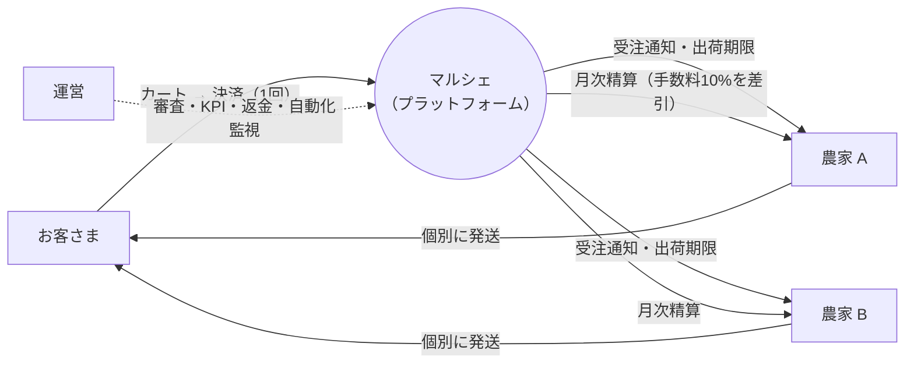
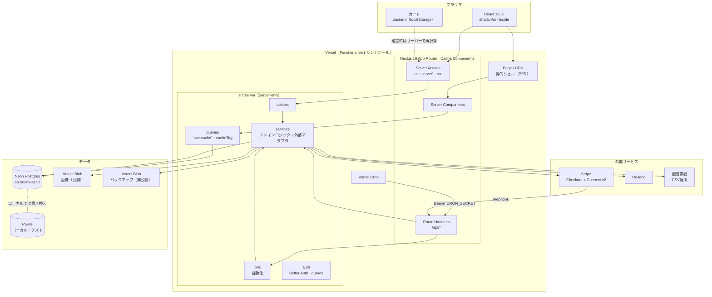
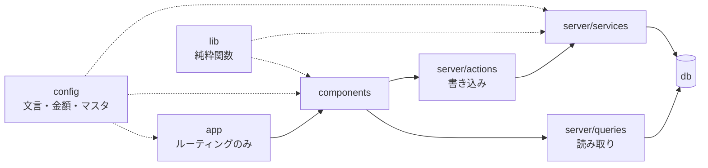
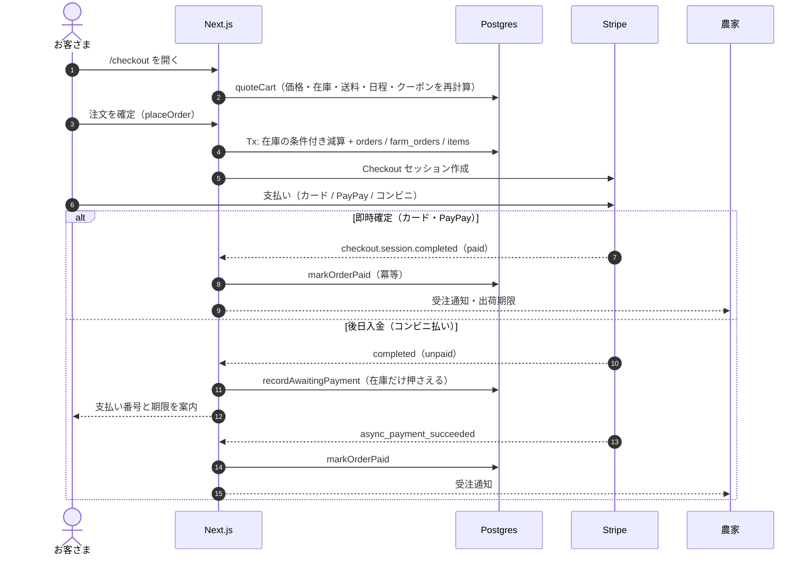
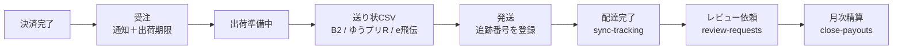
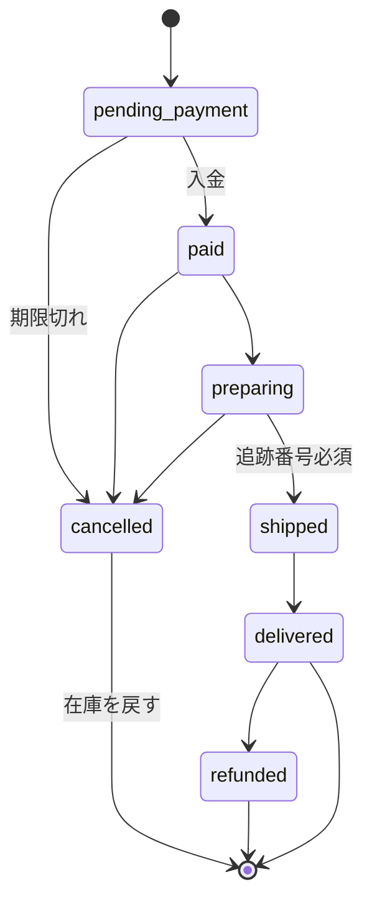
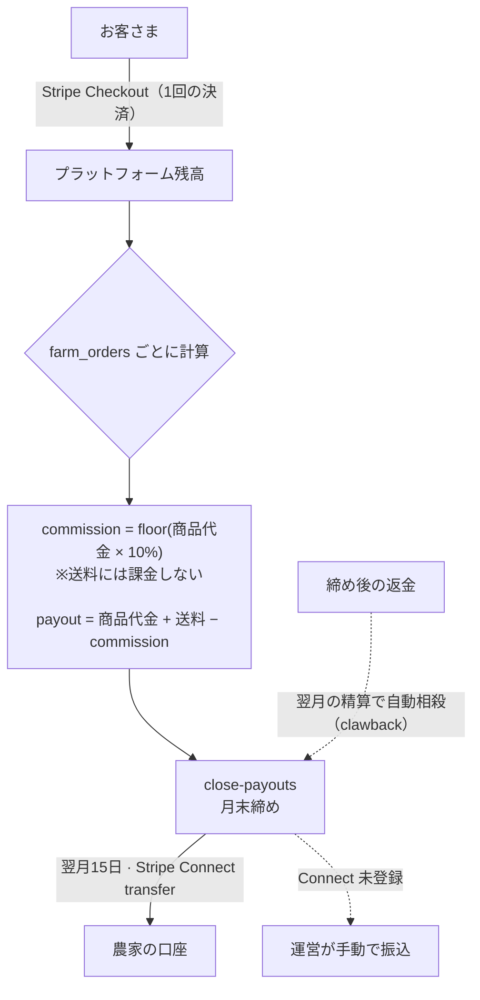
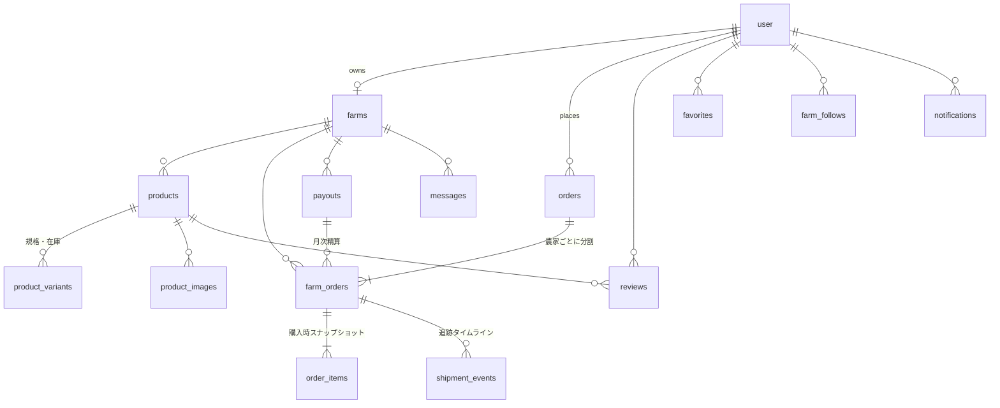
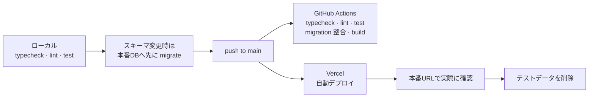

<div align="center">

#  あわじ玉ねぎマルシェ

**Awaji Onion Marché — 南あわじの玉ねぎ農家から、畑直送で全国へ**

食べチョク / ポケットマルシェ型の **マルチ出品者マーケットプレイス**（販売手数料 10%）

[](https://nextjs.org)
[](https://react.dev)
[](https://www.typescriptlang.org)
[](https://tailwindcss.com)
[](https://orm.drizzle.team)
[](https://neon.tech)
[](https://stripe.com)
[](https://awaji-marche.vercel.app)
[](.github/workflows/ci.yml)

 **本番**: https://awaji-marche.vercel.app &nbsp;·&nbsp;  **現況と引き継ぎ**: [`docs/STATUS.md`](docs/STATUS.md) &nbsp;·&nbsp;  **開発ガイド**: [`AGENTS.md`](AGENTS.md)

</div>

---

##  目次

- [全体像](#-全体像)
- [だれが何をできるか](#-だれが何をできるか)
- [アーキテクチャ](#-アーキテクチャ)
- [レイヤ構成とディレクトリ](#-レイヤ構成とディレクトリ)
- [購入フロー](#-購入フロー)
- [出荷と注文の状態](#-出荷と注文の状態)
- [お金の流れ](#-お金の流れ)
- [自動化（Cron）](#-自動化cron)
- [データモデル](#-データモデル)
- [守り（安全性と品質）](#-守り安全性と品質)
- [クイックスタート](#-クイックスタート)
- [スクリプト](#-スクリプト)
- [CI / デプロイ](#-ci--デプロイ)
- [ドキュメント](#-ドキュメント)

---

##  全体像

お客さまの **1回の決済** を、農家ごとの **出荷単位（`farm_orders`）** に分けます。各農家はそれぞれ出荷・精算します。運営は手数料を受け取り、月次でまとめて農家へ送金します。



---

##  だれが何をできるか

| | 利用者 | 主な機能 |
| :-: | --- | --- |
|  | **お客さま** `customer` |  商品検索・絞り込み ／  農家ページ ／  カート（農家別の送料と最短お届け日をその場で計算）／  お届け日時・のし指定 ／  決済（カード・PayPay・コンビニ払い・Apple Pay・Google Pay）／  注文追跡タイムライン ／  レビュー ／  お気に入り・フォロー ／  農家とのメッセージ ／  領収書 ／  退会（匿名化） |
|  | **生産者** `farmer` |  売上ダッシュボード ／  商品登録（写真・規格・在庫）／  受注管理 ／  **出荷センター**（送り状CSV: B2クラウド・ゆうプリR・e飛伝、追跡番号の一括取込、納品書の印刷）／  レビュー返信 ／  メッセージ ／  精算・振込（Stripe Connect）／  売上明細CSV ／  ショップページ編集 ／  受付の一時停止（お休み） |
|  | **運営** `admin` |  KPI・GMV・手数料分析 ／  出店審査 ／  商品・レビュー管理 ／  注文・返金 ／  ユーザー ／  精算 ／  クーポン ／  お知らせ ／  **自動化の監視と手動実行** ／  手数料率 ／  **本番公開チェック** |

>  ロールは1ユーザーに1つです。出店は customer が `/join` から申請し、admin が承認すると `farmer` になります。

---

##  アーキテクチャ



###  設計判断（ADR の要約）

| # | 決定 | 理由 |
| :-: | --- | --- |
| 1 |  **Drizzle + Neon / PGlite** | サーバーレスに向いていて型安全。ローカルは Docker なしで動く |
| 2 |  **Better Auth** | セルフホストでロールを拡張しやすく、Drizzle と直結でき、ベンダーロックがない |
| 3 |  **Separate charges & transfers** | 複数農家のカートを1回で決済し、月次まとめ送金で振込手数料を抑える |
| 4 |  **1 farm_order = 1 出荷** | 農家ごとに別発送する産直の実態に合い、状態機械が単純になる |
| 5 |  **カートはクライアント側** | 匿名でも速い。確定はサーバーで再計算するので改ざんされても問題ない |
| 6 |  **配送は CSV 連携 + アダプタ** | 国内キャリアは小口向けの公開APIが少ない。API契約後は `tracking.ts` を差し替える |
| 7 |  **Cache Components** | 公開ページは静的シェルとタグ無効化で、速くて常に新しい |
| 8 |  **PGlite の書き込みは1プロセスだけ** | 同時書き込みによる WAL 破損を実際に観測したため |
| 9 |  **関数リージョン = DBリージョン** | 1ページで十数クエリ走るので、エッジ近接より DB との往復削減が効く |

詳細 → [`docs/ARCHITECTURE.md`](docs/ARCHITECTURE.md)

---

##  レイヤ構成とディレクトリ

依存は **一方向** です（逆向きは禁止）。`config` と `lib` はどこからでも import できます。



```text
src/
├── app/                 ルーティング（薄く保つ）
│   ├── (shop)/             公開ストア  / products farms cart checkout about guide faq join legal
│   ├── (auth)/             login / signup
│   ├── mypage/             購入者
│   ├── farmer/             生産者
│   ├── admin/              運営
│   └── api/                auth · upload · webhooks/stripe · cron/[job] · farmer/{labels,sales}
├── config/              ★ 文言・金額・率・ナビ・配送設定の置き場（ハードコード禁止）
├── db/                  schema / client / seed
├── lib/                 純粋関数（format · dates · shipping計算 · env）
├── server/              サーバー専用
│   ├── auth/               Better Auth · requireRole / assertRole
│   ├── queries/            "use cache" + cacheTag
│   ├── actions/            "use server" · zod · 権限チェック · updateTag
│   ├── services/           orders · payouts · refunds · payments · shipping · email · backup …
│   └── jobs/               Cron ジョブ
├── components/          ui(shadcn) · common · charts · dashboard · layout · shop · farmer · admin …
└── stores/              zustand（カート）
```

###  絶対ルール

| | ルール |
| :-: | --- |
|  | **ハードコード禁止**。文言・金額・率・ステータス名は `src/config/*` から参照する |
|  | **DB に触るのはサーバー層だけ**（`queries` / `actions`）。コンポーネントから `db` を import しない |
|  | **認可は必ずサーバーで**行う（`src/server/auth/guards.ts`） |
|  | cookies / headers / `Date.now()` を読む部分は `<Suspense>` の中に置く |
|  | 金額は **整数（円）**、率は **bps**、日時は `timestamptz` |
|  | 外部サービスは `services/*` のアダプタ経由で呼ぶ。キーが無ければ **デモモード** で動く |

---

##  購入フロー



>  成功画面でもセッションを確認して `markOrderPaid` を呼びます（Webhook が遅れた場合の保険）。冪等なので二重に実行されても問題ありません。

---

##  出荷と注文の状態

###  出荷センターの流れ



###  `farm_orders.status` の状態機械

状態は必ず `services/orders.ts#transitionFarmOrder` で変更します（直接 UPDATE は禁止）。



###  送料とお届け日

| 計算 | 内容 |
| --- | --- |
|  箱数 | 重量合計から最大160サイズ（25kg）で箱数を決め、梱包 400g を足して収まる最小サイズを選ぶ |
|  ゾーン | お届け先の都道府県を8ゾーンに分ける（発送元は兵庫） |
|  送料 | ゾーン×サイズの基準額 × キャリア係数 × 箱数。農家の送料無料ラインを超えれば 0 円 |
|  日程 | 今日 + リードタイムを出荷曜日に繰り上げ、+ 輸送日数。複数農家のカートは全員が間に合う日から選べる |

同じ関数をカートの目安表示（クライアント）と確定（サーバー）の両方で使います。詳細 → [`docs/SHIPPING.md`](docs/SHIPPING.md)

---

##  お金の流れ



| 項目 | 仕様 |
| --- | --- |
|  手数料率 | 農園ごとの率 → 運営の設定 → 既定 10% の順で決まる。**注文時点の率を固定保存** |
|  クーポン | プラットフォーム負担（農家の受取額は減らない）。利用回数は注文作成時に条件付きで確保 |
|  最低振込額 | 1,000円（下回れば翌月へ繰り越し） |
|  決済手段 | コードで固定せず、**Stripe ダッシュボードで有効化したものだけ** を表示（dynamic payment methods） |

詳細 → [`docs/PAYMENTS.md`](docs/PAYMENTS.md)

---

##  自動化（Cron）

Vercel Cron が `/api/cron/[job]` を叩きます。どのジョブも冪等です。実行ログは `job_runs` に残り、`/admin/automation` で確認・手動実行できます。

|  JST | ジョブ | 内容 |
| :-: | --- | --- |
| 00:15 |  `cancel-unpaid` | 期限切れの未決済注文をキャンセルし、在庫とクーポンを戻す |
| 01:00 |  `close-payouts` | 月初に前月分を締めて精算を作成し、15日以降に送金（失敗分は翌日に再試行） |
| 02:30 |  `backup-db` | 全テーブルを JSON(gzip) で非公開 Blob に保存し、**読み戻して検証**。14日保持 |
| 06:00 |  `sync-tracking` | 配達完了を自動で反映 |
| 08:00 |  `ship-reminders` | 出荷期限が近い未発送を農家に通知 |
| 10:00 |  `review-requests` | 配達3日後にレビューを依頼 |

>  ジョブが失敗したとき、または30時間成功していないときは、**運営全員にアラート** が届きます（`services/ops-alerts.ts`）。

---

##  データモデル



**その他**: `coupons` / `announcements` / `platform_settings` / `job_runs`（自動化ログ）

| 規約 | |
| --- | --- |
|  金額 | 整数（円） |
|  率 | bps（1000 = 10%） |
|  重量 | g |
|  業務日 | `date`（JST, `YYYY-MM-DD`） |
|  時刻 | `timestamptz` |

詳細 → [`docs/DATA_MODEL.md`](docs/DATA_MODEL.md)

---

##  守り（安全性と品質）

| | 守っていること | 仕組み | 回帰テスト |
| :-: | --- | --- | --- |
|  | 在庫の売り越しを防ぐ | `stock >= 数量` の行だけを減らす条件付き更新 | `stock-race` |
|  | クーポンの上限超えを防ぐ | 注文作成時に `used_count < max_uses` の行だけ +1 | `coupon-limit` |
|  | 返金の二重実行を防ぐ | 対象を先に確保してから Stripe を呼ぶ | `refund-race` |
|  | コンビニ払いの期限切れ後に入金されない | 打ち切り前に PaymentIntent を cancel | `deferred-payment` · `cancel-unpaid-stripe` |
|  | 決済から送金までのつなぎ目が壊れない | 注文 → Webhook → 出荷 → 配達 → 締め → 送金 を1本で通す | `golden-route` |
|  | 他人のデータに触れない | 全 Action の認可テスト | `authorization` |
|  | バックアップを本当に戻せる | 保存後に読み戻し、使い捨てブランチへの復元を検証 | `backup` · `restore` |
|  | 公開判断を誤らない | 「鍵があるか」ではなく「実際に動いているか」を判定 | `go-live` |

** テストの方針**: 守りを足したら、対象のコードを **わざと壊して、テストが赤くなることまで確認** します（[`docs/STATUS.md`](docs/STATUS.md) §4.2）。

** その他**: 本番 CSP · `X-Frame-Options: DENY` · 認証 API のレート制限 · ロール変更時にセッションを全破棄 · 退会は行を消さずに個人情報だけ匿名化。

---

##  クイックスタート

```bash
npm install
npm run dev
```

 **DB は自動** で用意されます（組込み Postgres = PGlite を `.data/pglite` に作成し、migrate と seed まで実行）。Docker は要りません。外部サービスのキーが無くても **デモモード** で動きます（ デモ決済 /  メールはログに出力）。

| デモアカウント | メール | パスワード |
| --- | --- | --- |
|  お客さま | `customer@demo.awaji` | `awaji-demo-2026` |
|  生産者 | `farmer@demo.awaji` | `awaji-demo-2026` |
|  運営 | `admin@demo.awaji` | `awaji-demo-2026` |

>  Node 22 以上、**npm 11.6.2** を使ってください。npm 10 だと lockfile の表現が変わり、CI の `npm ci` が落ちます。依存を変更したら `npm run deps:verify` を実行します。

---

##  スクリプト

| | Script | 内容 |
| :-: | --- | --- |
|  | `npm run dev` | 開発サーバー（PGlite を自動起動） |
|  | `npm run build` | migrate（`DATABASE_URL` があるとき）+ 本番ビルド |
|  | `npm test` | Vitest（純関数と、PGlite を使う注文・返金・自動化ジョブの統合テスト） |
|  | `npm run typecheck` / `lint` | 型チェック / Lint |
|  | `npm run db:generate` / `db:migrate` / `db:seed` / `db:reset` | マイグレーション生成・適用 / シード |
|  | `npm run db:restore` | バックアップから復元 |
|  | `npm run demo:purge` | 本番公開前にデモデータを削除 |
|  | `npm run admin:promote <メール>` | 運営アカウントに昇格（**デモ削除より先に**） |
|  | `npm run deps:verify` | CI と同じ npm で lockfile を検証 |

---

##  CI / デプロイ



| 環境 | |
| --- | --- |
|  URL | https://awaji-marche.vercel.app |
|  Hosting | Vercel（Functions `sin1`） |
|  DB | Neon Postgres `ap-southeast-1`（関数と同じリージョン） |
|  画像 /  バックアップ | Vercel Blob（公開ストア / 非公開ストア） |

 **公開できる状態かは `/admin/settings` →「本番公開チェック」が判定します。** Stripe 本番キー・デモモード・運営アカウント・特商法表記・バックアップ・自動処理の稼働をまとめて確認できます。準備中は `robots.txt` が自動で `Disallow: /` を返します。

環境変数と手順 → [`docs/DEPLOY.md`](docs/DEPLOY.md) ／ 残りのオーナー作業 → [`docs/STATUS.md`](docs/STATUS.md)

---

##  ドキュメント

| | Doc | 内容 |
| :-: | --- | --- |
|  | [`STATUS.md`](docs/STATUS.md) | **いまどこまで出来ていて、次に何をするか**（引き継ぎはまずここ） |
|  | [`ARCHITECTURE.md`](docs/ARCHITECTURE.md) | 全体構成・ディレクトリ・レイヤ責務・ADR |
|  | [`DESIGN.md`](docs/DESIGN.md) | UI・デザイントークン・コピーのトーン |
|  | [`DATA_MODEL.md`](docs/DATA_MODEL.md) | テーブル・型・状態遷移 |
|  | [`SHIPPING.md`](docs/SHIPPING.md) | 送料計算・出荷自動化・Cron |
|  | [`PAYMENTS.md`](docs/PAYMENTS.md) | 決済・手数料・精算・返金 |
|  | [`PERFORMANCE.md`](docs/PERFORMANCE.md) | キャッシュ・遅延読込・Cache Components の規約 |
|  | [`CONVENTIONS.md`](docs/CONVENTIONS.md) | コーディング規約・命名・Server Action の型 |
|  | [`DEPLOY.md`](docs/DEPLOY.md) | ローカル起動・Vercel デプロイ・環境変数 |
|  | [`AGENTS.md`](AGENTS.md) | AI エージェント／開発者向けの入口 |

<div align="center">

---

 **Made with love on Awaji Island** 

</div>
